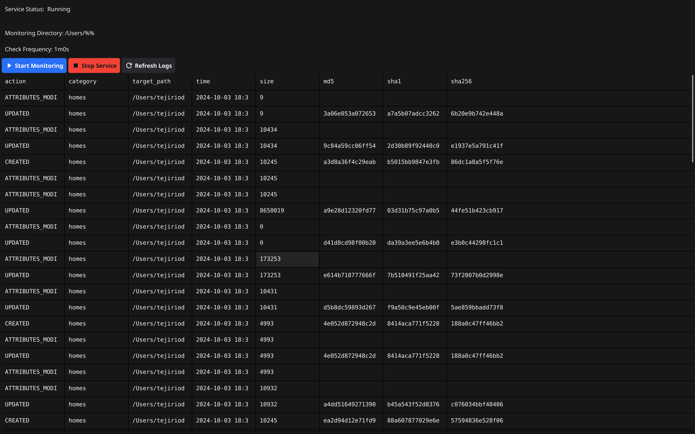

# File Modification Tracker



This project is a File Modification Tracker implemented in Go, designed to run as a background service on macOS. It tracks and records modifications to files in a specified directory, integrates system monitoring via osquery, and provides a simple UI for interaction.

## Prerequisites

- macOS (tested on macOS Mojave and later)
- Go (version 1.20 or later)
- osquery
- Homebrew (for easy installation of dependencies)

## Intsallation using source code
1. Clone the repository
   ```
   git clone git@github.com:tejiriaustin/filemodtracker.git
   ```

2. Install osquery using Homebrew
   ```
   brew install osquery
   ```

3. Verify osquery installation:
   ```
   osqueryi --version
   ```
4. Install GCC (MinGW-w64) For windows or Linux Devices
   - Download from mingw-w64.org or use MSYS2
   - Add MinGW-w64 bin directory to PATH

5. verify GCC
    ```
   gcc --version
   ```

6. Graphics Library for Linux Devices
   - Install either:
     - OpenGL drivers (usually pre-installed on Windows)
     - Mesa3D software renderer for systems without GPU

7. Install the daemon
    ```
   make install
   ```
8. Start the Daemon
    ```
   make daemon
   ```
9. Start the UI
    ```
   make ui
   ```
10. Visit the url below to verify the service is running
   ```
   http://localhost/health
   ```

Note: Please ensure osquery is properly installed and running

## Installation Using .PKG for macOS

1. Install osquery using Homebrew:
   ```
   brew install osquery
   ```

2. Verify osquery installation:
   ```
   osqueryi --version
   ```

3. Install the File Modification Tracker:
   ```
   sudo installer -pkg FileModTracker.pkg -target /
   ```

4. Verify the installation:
   ```
   ls /usr/local/bin/filemodtracker
   ```

## Configuration

1. Open the configuration file:
   ```
   sudo nano /usr/local/etc/filemodtracker/config.yaml
   ```

2. Update the following settings:
   ```yaml
   monitored_directory: "/Users/username/Documents/filemodtest"
   check_frequency: 60  # in seconds
   api_endpoint: "http://localhost:8000"  # or your desired endpoint
   ```

3. Save and exit (Ctrl+X, Y, Enter)

## Usage

### Starting the Service

1. Load the service:
   ```
   sudo launchctl load /Library/LaunchDaemons/com.example.filemodtracker.plist
   ```

2. Verify it's running:
   ```
   launchctl list | grep filemodtracker
   ```

### Using the File Modification Tracker

1. Create, modify, or delete files in the monitored directory:
   ```
   echo "Hello, world!" > ~/Documents/filemodtest/testfile.txt
   echo "New content" >> ~/Documents/filemodtest/testfile.txt
   rm ~/Documents/filemodtest/testfile.txt
   ```

2. View the logs:
   ```
   cat /var/log/filemodtracker.log
   ```

### HTTP Endpoints

- Health check:
  ```
  curl http://localhost:80/health
  ```
- Send commands to the worker thread:
  ```
  curl -X POST -H "Content-Type: application/json" -d '{"commands":["echo Hello", "ls -l"]}' http://localhost:80/commands
  ```
- Retrieve logs:
  ```
  curl http://localhost:80/logs
  ```

### UI Interaction

Use the provided AppleScript to interact with the service:

1. Open Script Editor and paste the provided script
2. Run the script to start, stop, or view logs

### osquery Integration

Run osquery commands to get file information:
```
osqueryi "SELECT * FROM file WHERE path = '/Users/username/Documents/filemodtest/testfile.txt'"
```

## Uninstallation

To uninstall the service:
```
sudo /usr/local/bin/uninstall_filemodtracker.sh
```

## Troubleshooting

If you encounter issues with osquery:

1. Check Homebrew's information about osquery:
   ```
   brew info osquery
   ```

2. Try relinking osquery:
   ```
   brew link osquery
   ```

3. If issues persist, reinstall osquery:
   ```
   brew uninstall osquery
   brew install osquery
   ```

## Contributing

1. Fork the repository
2. Create your feature branch (`git checkout -b feature/AmazingFeature`)
3. Commit your changes (`git commit -m 'Add some AmazingFeature'`)
4. Push to the branch (`git push origin feature/AmazingFeature`)
5. Open a Pull Request

## Contact

Tejiri Austin - tejiiaustin123@example.com

Project Link: [https://github.com/tejiriaustin/filemodtracker](https://github.com/tejiriaustin/filemodtracker)